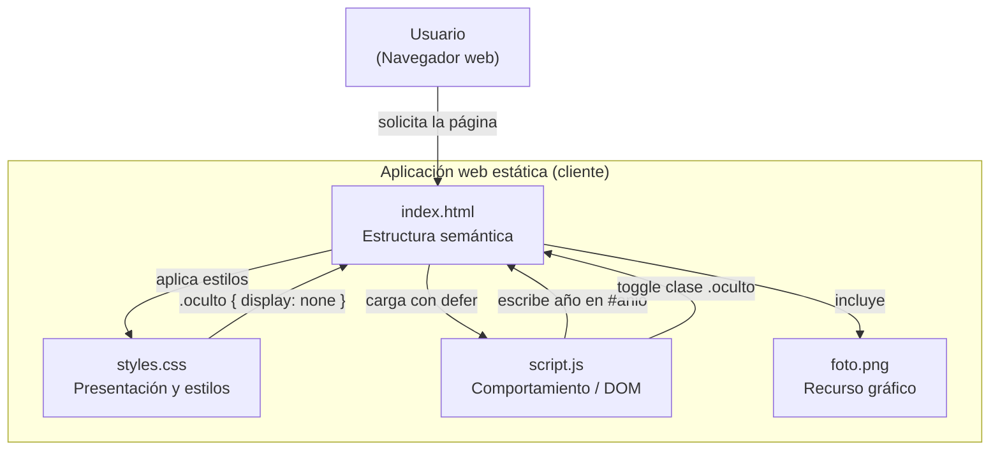
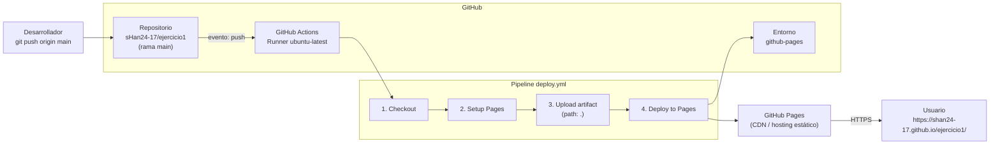

# Ejercicio 1 — Tarjeta de presentación

Sitio web estático (HTML5, CSS3 y JavaScript) que muestra una tarjeta de
presentación personal, con secciones de **Sobre mí**, **Habilidades** y
**Contacto**. El proyecto se despliega automáticamente en **GitHub Pages**
mediante **GitHub Actions**.

- **Sitio publicado:** https://shan24-17.github.io/ejercicio1/
- **Repositorio:** https://github.com/sHan24-17/ejercicio1

---

## 1. Descripción del proyecto

| Elemento | Descripción |
| --- | --- |
| `index.html` | Estructura semántica (`header`, `main`, `section`, `footer`). |
| `styles.css` | Presentación, distribución y estilos visuales. |
| `script.js` | Comportamiento dinámico sobre el DOM. |
| `foto.png` | Fotografía de perfil usada en la sección "Sobre mí". |
| `.github/workflows/deploy.yml` | Pipeline de CI/CD para publicar en GitHub Pages. |

### Funcionalidad de JavaScript
- Inserta el año actual en el `footer` (`#anio`).
- Alterna la visibilidad de la lista de habilidades (`#listaHabilidades`) mediante la clase CSS `.oculto`.

---

## 2. Estructura del repositorio

```
ejercicio1/
├── .github/
│   └── workflows/
│       └── deploy.yml      # Pipeline de despliegue
├── foto.png                # Recurso gráfico
├── index.html              # Página principal
├── script.js               # Lógica del cliente
├── styles.css              # Hoja de estilos
└── README.md               # Este documento
```

---

## 3. Pasos realizados en el ejercicio

### Fase 1 — Proyecto base
1. Se creó el sitio estático con `index.html`, `styles.css`, `script.js` y `foto.png`.
2. Se hizo `git init` y el primer commit.
3. Se vinculó el repositorio remoto y se subió la rama `main`:
   ```bash
   git remote add origin https://github.com/sHan24-17/ejercicio1.git
   git push -u origin main
   ```

### Fase 2 — Configuración de GitHub Actions
4. Se creó el workflow `.github/workflows/deploy.yml` con las siguientes etapas:
   - **Checkout** del código (`actions/checkout@v4`).
   - **Setup Pages** (`actions/configure-pages@v5`).
   - **Upload artifact** (`actions/upload-pages-artifact@v3`) del directorio raíz.
   - **Deploy to GitHub Pages** (`actions/deploy-pages@v4`).
5. Se definieron los permisos mínimos necesarios del `GITHUB_TOKEN`:
   ```yaml
   permissions:
     contents: read
     pages: write
     id-token: write
   ```
6. Se configuró la concurrencia para evitar despliegues simultáneos:
   ```yaml
   concurrency:
     group: "pages"
     cancel-in-progress: false
   ```

### Fase 3 — Incidencias encontradas y solución
7. **Primer error — `Not Found` en `Setup Pages`:** el sitio de Pages aún no existía. GitHub Pages no estaba habilitado.
8. **Segundo intento — `enablement: true` en `configure-pages`:** falló con
   `Create Pages site failed. Error: Resource not accessible by integration`.
   La causa es que **el `GITHUB_TOKEN` automático no puede crear el sitio de
   Pages**: crear un sitio de Pages es una operación de administración del
   repositorio y el token del workflow no tiene (ni puede recibir) ese permiso.
   El parámetro `enablement` solo funciona con un **Personal Access Token** o un
   token de GitHub App.
9. **Solución:** habilitar Pages una única vez de forma manual en
   **Settings → Pages → Build and deployment → Source → GitHub Actions**.
   Tras habilitarlo, el workflow estándar funciona con el token por defecto.
10. Se disparó el workflow y el despliegue finalizó con `success`.

### Fase 4 — Verificación
11. Se confirmó el run exitoso en GitHub Actions.
12. Se verificó que el sitio responde **HTTP 200** y sirve el contenido correcto.

---

## 4. Diagrama de arquitectura de software

Estructura de componentes del sitio y relación entre ellos:



### Responsabilidades de cada componente

| Componente | Tipo | Responsabilidad |
| --- | --- | --- |
| `index.html` | Estructura | Marcado HTML5 semántico y contenido. |
| `styles.css` | Presentación | Layout, colores, tipografía y estado visual `.oculto`. |
| `script.js` | Comportamiento | Año dinámico y alternar habilidades. |
| `foto.png` | Recurso | Imagen de perfil. |

---

## 5. Diagrama de arquitectura de despliegue

Flujo de integración y entrega continua (CI/CD) desde el `push` hasta el usuario final:



### Detalle del pipeline

| Paso | Acción | Función |
| --- | --- | --- |
| 1 | `actions/checkout@v4` | Descarga el código en el runner. |
| 2 | `actions/configure-pages@v5` | Obtiene/valida la configuración de Pages. |
| 3 | `actions/upload-pages-artifact@v3` | Empaqueta el sitio como artefacto. |
| 4 | `actions/deploy-pages@v4` | Publica el artefacto en GitHub Pages. |

---

## 6. Ejecución local

Al ser un sitio estático, basta con abrir `index.html` en el navegador o servir
la carpeta con un servidor local:

```bash
python -m http.server 8000
```

Luego abrir `http://localhost:8000`.

---

## 7. Despliegue

El despliegue es **automático**: cada `push` a la rama `main` dispara el
workflow y publica la nueva versión. También puede lanzarse manualmente desde
la pestaña **Actions → Deploy to GitHub Pages → Run workflow**
(`workflow_dispatch`).

---

## 8. Tecnologías utilizadas

- HTML5 semántico
- CSS3 (Flexbox, box-sizing)
- JavaScript (DOM API)
- Git y GitHub
- GitHub Actions (CI/CD)
- GitHub Pages (hosting estático)
- Mermaid (diagramas de documentación)
